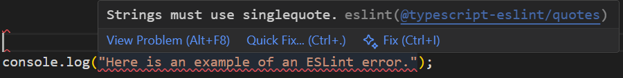

I look at coding standards like learning a foreign language. Just as grammar and sentence structure help you communicate clearly, coding standards help you to write clear and consistent code. In this analogy, ESLint is my tutor and translator. It doesn’t just point out my mistakes, it teaches me how to say things “the right way” in code. Over time, just like with any language, the rules start to become second nature. Coding standards begin to shape not just what you write, but how you think about structure, logic, and clarity. Just like learning a second language helps you better understand your first, learning to code with standards makes you more aware of what makes good code in general. When learning a new language, there are always challenges, but a good tutor can make all the difference. 

## Muy bien

This is my first week using ESLint with VSCode, and so far, I like it. One feature that stands out is that with VSCode, I don’t have to switch between multiple screens. I can have a TypeScript file, an HTML file, a terminal window, and even a live preview of HTML output, all within the same window. Another thing I like is that ESLint shows you exactly where errors are and explains them with clear and easy-to-understand messages. Being able to correct the errors as they occur is allowing me to see the correlation between code and structure. It feels like ESLint is more of a teacher, guiding me through the rules of coding. 

## En general 

Overall, I have been pretty impressed with VSCode and ESLint. I find that each time ESLint points out a mistake, it feels like a mini-lesson in proper TypeScript coding standards. These experiences have helped me see just how important coding standards are in relation to any programming language. Just as consistent grammar makes a spoken language clear and understandable, consistent code style keeps a program readable and functional. And I look forward to reaching a point where coding standards become coding habits, and I can consider myself bi-lingual.
