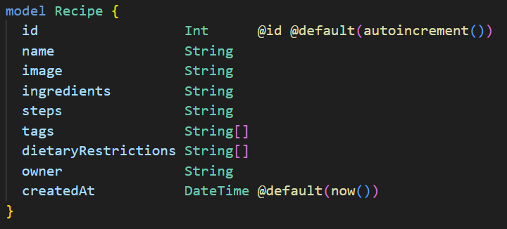
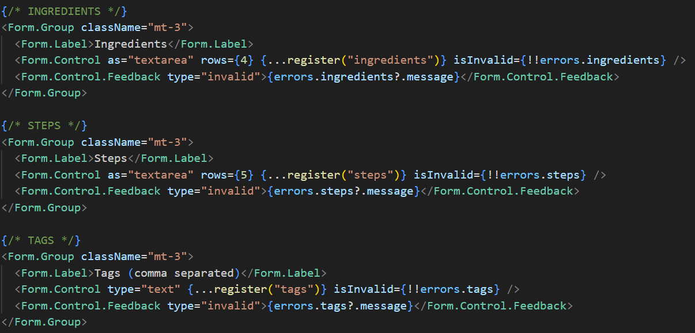
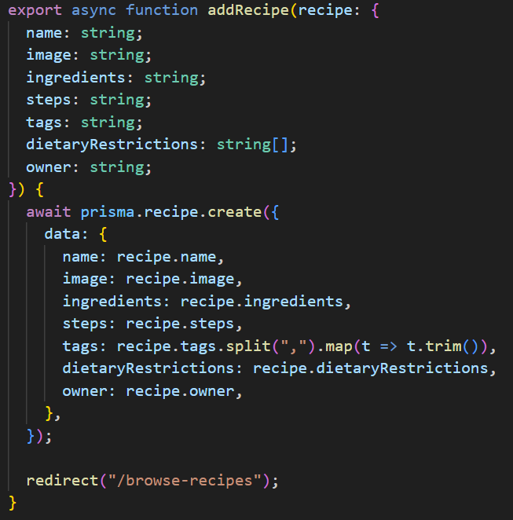

## The Recipe Book

As someone learning to cook, I’ve discovered that good recipes are the foundation of every great dish. A recipe doesn’t just tell you what to make, it guides you through a reliable method that cooks have tested and refined. In the same way, design patterns offer developers a trusted approach to solving common problems. They show you the structure, the steps, and the reasoning behind the solution. And just like a cook adjusts their ingredients to taste, developers can adapt design patterns to fit the unique flavor of their project. Design patterns are proven systems to add to my coding cookbook.

## Club Oven Lovin'

My group project is a platform that helps college students find, share, and cook affordable, easy-to-make meals using minimal kitchen resources. Looking at my part of the project, the most obvious design pattern I see is the Model-View-Controller (MVC) pattern. Prisma for the Model, React components as the View, and server actions as the Controller. The Model layer is shown clearly in the `Recipe` model defined in `schema.prisma`. The Model is responsible for defining what information a recipe contains.

  

Then, the React component that collects user input (`AddRecipeForm.tsx`) clearly functions as the View by rendering fields, managing form state, and triggering the controller action with user data. The View is responsible for displaying information and collecting what the user types, without interacting with the database.

  

Finally, the “C” layer appeared in my `dbActions.ts` file, where the `addRecipe` function acted exactly like a Controller: receiving input from the UI, transforming data (such as splitting and trimming tag strings), and communicating with the database to store new recipes. The Controller is responsible for preparing and saving the data coming from the user so it can be used later.

  

While I understand that MVC is a formal design pattern, to me it feels like the natural way my mind organizes responsibilities. Each part has its place, just like ingredients and steps in a recipe.

## Get Cooking

Learning to cook also means learning good kitchen habits, preheating the oven, cleaning as you go, and using proper knife skills. These small, repeatable practices ensure that your meals turn out right. In software engineering, design patterns play the same role. They are reliable techniques that save time, reduce mistakes, and keep the workflow smooth. Since design patterns are well-tested solutions to common problems, developers don’t need to invent a new approach each time. After all, no one needs to invent a new way to boil water.