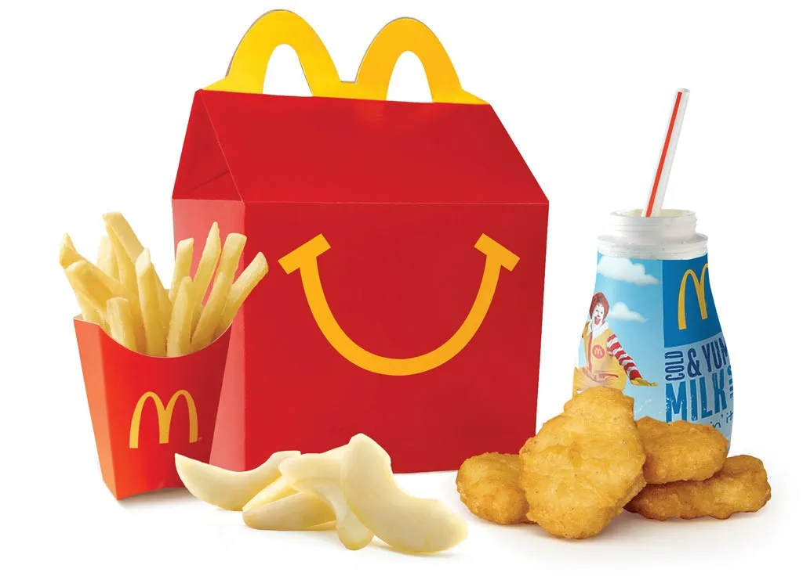

We live in a world that moves quickly, where results are expected almost instantly. From fast food to online shopping, instant gratification is what people want. But it’s the path for getting to that point that interests me. Creating efficiency is a process of identifying variables and providing solutions. It’s defining the procedure and creating the mechanism to achieve it. Coding is simply another way to use logic to streamline a function.

## Would you like fries with that?
	
When you ask a question, the answer often results in a new question. By following these branches of logic, you are able to reach a definitive conclusion. In fast food it’s called up-selling, in coding this would be similar to if-else statements. But while fast food gives you a few options, if-else statements offer you the world. They are one of my favorite things in coding, because they give you as many options as you want or need. 

As a “math person” I appreciate structure and rules. While I am relatively new to coding, I see it as a process of logical thought that is similar to mathematics. They both rely on step-by-step reasoning, problem-solving, and attention to detail. In math, you use symbols and formulas; in coding you use variables and functions. For me, this feels like learning a new language. And when your new language holds similarities with your first language, learning becomes a little easier. 

## Happy Meals!

The thought of becoming multilingual in programming Languages is something that really motivates me. It’s not just the learning process, it’s the idea of what I will be able to do with these skill sets. Being able to work effectively in whatever language the situation requires will increase my value as a programmer and my confidence as an introvert. If computer science were a Value Meal, I would want to Super Size it.
