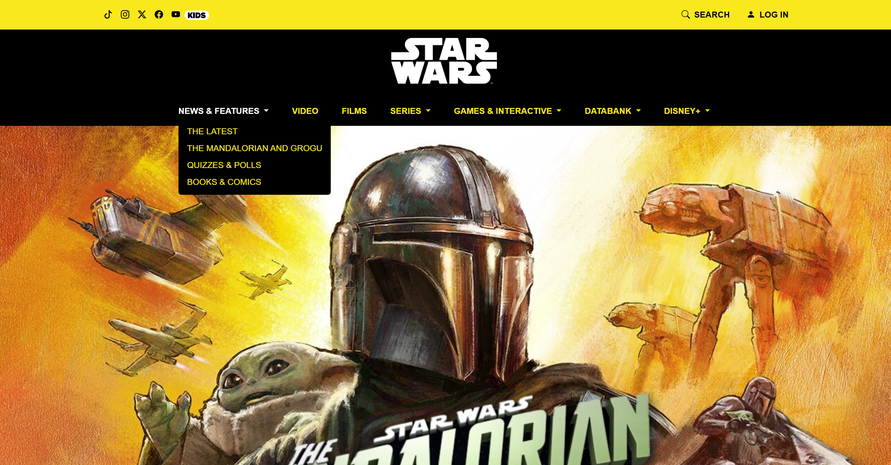

When I first heard about UI frameworks like Bootstrap 5, I was both excited and a little nervous. We were told they could be challenging to learn and get comfortable with. But after spending a week working with Bootstrap, I’ve started to see why so many developers rely on it. UI frameworks are tools that help you build user interfaces faster by providing ready-to-use design elements like buttons, menus, and layout systems. They can be confusing at first, because even a small mistake like using the wrong class name can throw off your entire layout. I personally struggled a bit with dropdown menus and positioning icons. But once I got the hang of it, I began to appreciate how powerful and helpful these frameworks can be. So far, it’s been challenging but also kind of fun.

## Rebuilding a Galaxy with Bootstrap 5

Below are two images of a webpage I built using Bootstrap 5 as I worked on rebuilding a subset of the Star Wars homepage. This experience really showed me how UI frameworks like Bootstrap can make complex layouts possible, even for beginners, but they still come with a learning curve. At the top of my page is a navigation bar that includes several icons like TikTok, YouTube, Instagram, and more, as well as an image serving as a fake link to Star Wars Kids. On the right side of the navbar, I added a search icon with text and a login section. The main menu items below the navbar have hover effects, with most also featuring dropdowns. While Bootstrap made these features easier to implement, it still took time to understand how the components and classes worked together. Trying to build all these features from scratch using just raw HTML and CSS would have taken much longer, especially for the dropdown menus and hover effects. The footer was the hardest part; aligning the icons and text in one centered line took multiple attempts, but it showed me how precise Bootstrap can be when you use it correctly.

  
  

## From Padawan to Page Builder

Taking the time to learn and understand UI Frameworks is definitely time well spent. While HTML and CSS give you full control, they require much more time and effort for even simple tasks like spacing and alignment. That is where Bootstrap 5 saves a lot of time by providing pre-designed components like buttons and navigation bars. UI frameworks also help keep your code organized and consistent, which makes it easier to read, update, and share with others. They can speed up your workflow, reduce repetitive work, help you build professional-looking websites more efficiently, and make your projects easier to maintain. Overall, UI Frameworks allow you to work more quickly and efficiently, and as such, they are a tool worth learning how to use.
