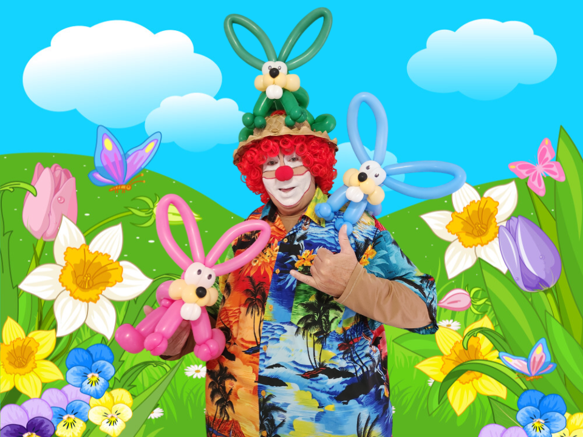

One of the more colorful projects I have been working on is a series of promotional flyers for a local children's entertainer. I design and create flyers for email campaigns, online advertising, and social media posts. The goal is to create eye-catching and easy-to-understand advertisements that don’t require a lot of reading. The idea is to plant the seed and provide follow-up contact information.

While I don’t choose the subject of each promotion, I am in complete control of the layout, colors, and artistic design. I use Google Slides to create the flyers because it is quick and easy to use for simple graphic projects. I handle the photography as well as using Photoroom to remove any unwanted backgrounds. I use ChatGPT to smooth out the verbiage that is provided in context to the subject matter.

These projects have helped me to see the importance of first impressions. I’ve learned that something as simple as a contrast of colors can draw a person in or cause them to be indifferent. Also, while simplicity works, sometimes you have to add a few words to accurately present the message. Simple projects might seem straightforward, but the design creativity shines through in the details.

You can view one of the storytelling flyers here: Chris Da Clown Springtime Balloon Storytelling Flyer
