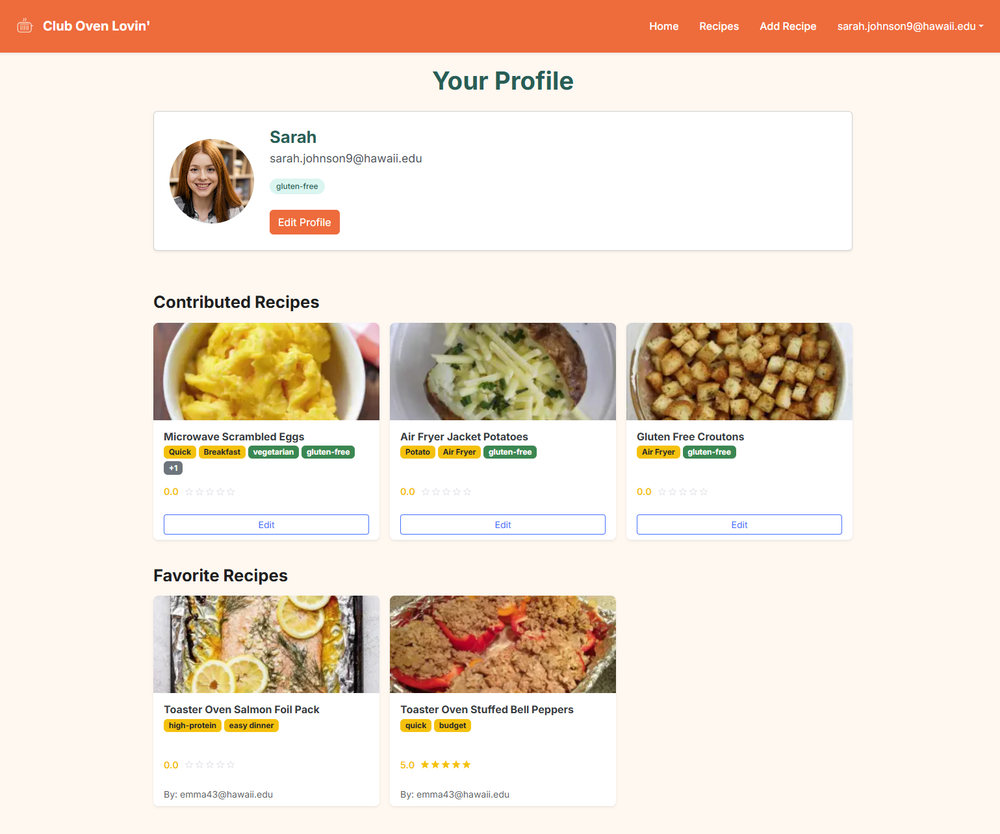
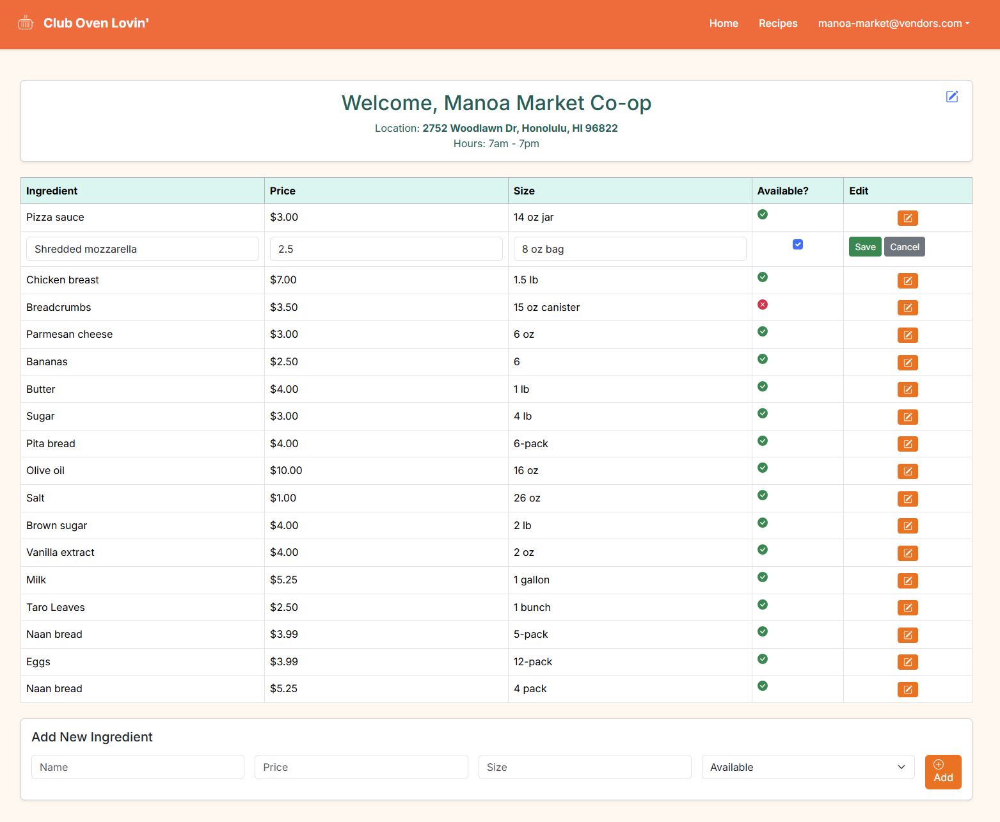

  
  

Club Oven Lovin’ is a group project that focuses on building a web-based platform to help college students discover, share, and manage simple home-cooked meals. The application allows users to browse recipes by name, ingredients, tags, or dietary restrictions, making it easier to find meals that match personal needs. Students can contribute their own recipes, leave reviews, and interact with content created by other users. Vendors can manage ingredient information such as pricing and availability, while admins oversee site content. The overall goal of this project is to give students with limited resources practical access to nutritious cooking while encouraging the use of locally available food options.

One of my main contributions to the project was building and improving both the User Profile page and the Vendor page. For the User Profile page, I created the full layout that allows users to view their personal information, see the recipes they have contributed, edit those contributed recipes, and view their favorite recipes. I also built a separate Edit User Profile page, which users can access by clicking the “Edit Profile” button on the profile page, where they can update their name, email, profile image URL, and dietary restrictions. For the Vendor page, I created a page that allows vendors to add ingredients they carry, including the ingredient name, price, size, and availability. I also implemented an edit feature that lets vendors update ingredient details directly from a table. In addition, I created an Add Recipe page with a form that allows users to submit new recipes and added a Favorite button so users can save recipes they want to revisit later.

This project helped me gain a better understanding of how larger web applications are structured and how different features work together within a single system. I learned how important it is to think about maintainability, especially when multiple pages rely on shared user and recipe data. Working as part of a group also showed me how important communication and clear task boundaries are when several people are contributing to the same project. Using Issue Driven Project Management (IDPM) helped organize the work into small, focused issues, which made it easier to track progress and avoid overlap or confusion. Overall, this project reinforced that effective software development depends not only on writing code, but also on planning, coordination, and building features that work reliably for real users.

For more details and to view the source code, visit the [Club Oven Lovin’ GitHub organization page](https://github.com/club-oven-lovin).