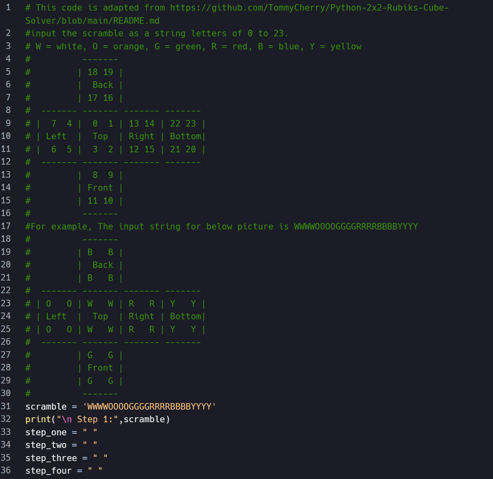

  

When I received my Bachelor's Degree, my Senior Research Project was the highlight of my year. It explored the logic and algorithms behind a simple sequential move puzzle known as the Pocket Cube and the Rubik's Cube. The project outlined manual algorithms and analyzed the group theory behind each puzzle. The bulk of the work was using Replit to adapt a Python program that creates a step-by-step algorithm to manually solve a Pocket Cube. 

I worked on this project with my Mentor, Dr. Veny Liu, at the University of Hawaii West Oahu. It was my responsibility to identify and correct errors in the original source code that we found on GitHub. I then adapted and reorganized the Python code into a reliable 7-step solution process. I also tested the program to ensure that it worked on a variety of scrambles, not just simple variations.

This project taught me a lot about modifying existing code rather than building from scratch. I learned more about the potential for AI tools like ChatGPT for understanding logic errors and suggesting code improvements. I believe I improved my understanding of how logic branches are used when the input variations are more complex. I also learned that clear user instructions to ensure correct input are just as important as the underlying code. 

You can view the full adapted code here: [Solving a Pocket Cube Code](https://github.com/chloe-teijeiro/senior-research-project-code)
