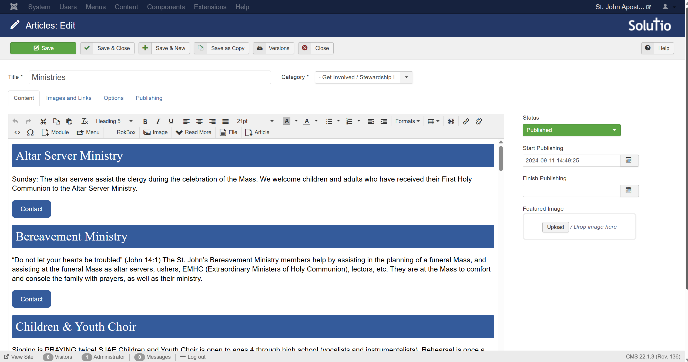

I recently worked as part of a team to design and build a website for Saint John Apostle and Evangelist Catholic Church. Our goal was to create a clear and easy-to-navigate site that would help parishioners find information and connect with ministries. We used Solutio Software, which is a company that builds templated, customizable websites for Catholic churches and dioceses. Together, we designed the website's layout, tabs, and submenus. 

After we decided on the layout and content, I added the majority of verbiage (written by others) to the pages. I uploaded all of the PDF links, embedded files, and connected the relevant resources. I also added contact links for each ministry and council within the website's submenu, connecting them to the appropriate individuals and ensuring the contact buttons led to the correct information. Additionally, I came up with a way to allow easy contact updates when leaders are changed, without redoing the entire structure. I did not write code for this project; I used Solutio’s dashboard and form-based editor to manage the website’s content and layout.

This project was bigger than I expected. It taught me a lot about the complexity of structuring websites for real-world users. I learned the importance of maintainability and how to organize backend content to simplify future updates. With the help of my teammates, I also gained a greater understanding of the importance of a quality user experience, especially when navigating a large number of ministries and contacts. This project taught me that even without coding, web design still requires logic, planning, and attention to detail.

You can view the finished website here: [Saint John Apostle and Evangelist Catholic Church Website](https://www.stjohnmililani.org/)
